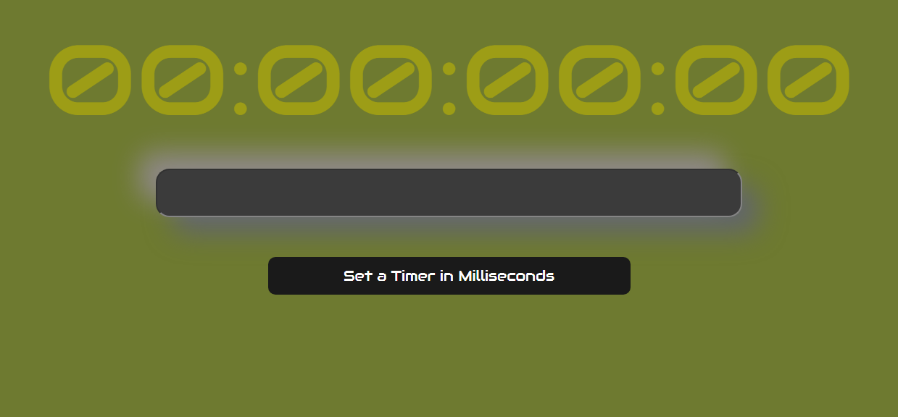

# Bomb Stopwatch

  

# Description

A time bomb was created in this repository. To run it, just enter the time you want it to last, a password and that's it, just enter the password before the clock reaches 0!

# How to use

When you start the app, you will have a reset clock on your home screen and an Input to fill in. When you put some value in it and press the button, another Input will appear for you to enter the password that disarms the bomb. When you press the button, the pump timer starts and will only be stopped with the correct password. It better be quick!!

# Steps

## 🤔 Why?
This repository was created to be used in a youth camp game, it is possible to improve some specific things such as: adding sound; Add a prettier message, feel free to modify!

# Finally 
This repository was created using: React; Typescript; Vite; Sccs(SASS).

  

  <a href="#roadmap">React</a> • 
  <a href="#roadmap">Vite</a> • 
 <a href="#roadmap">TypeScript</a> • 
 <a href="#tecnologias">SCSS</a> • 
 <a href="#contribuicao">Front-end</a> • 

  <a href="#autor">Gomes</a>

<h1 align="center">
  ⏱️💣🧨‼️
</h1>
